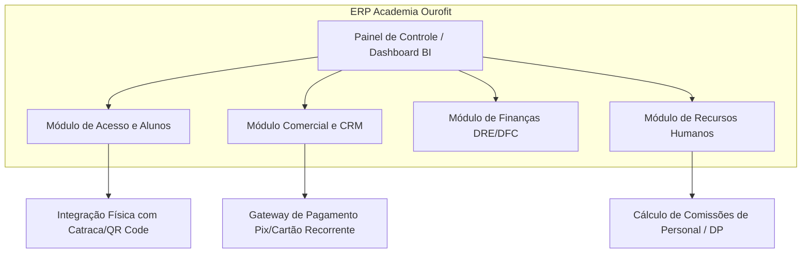
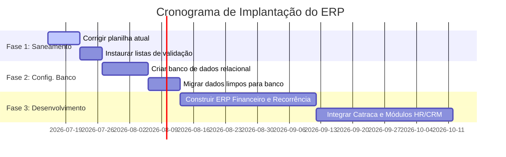

# Relatório de Diagnóstico Financeiro, Auditoria de Dados e Especificação de Requisitos para ERP
**Empresa:** Academia Ourofit  
**Gestora:** Isabela de Macedo Ornelas  
**Data de Emissão:** 13 de Julho de 2026  
**Planilha Analisada:** [Fluxo de Caixa Setembro.xlsm](file:///c:/Users/Leonardo/Desktop/Leo/Desenvolvimento%20de%20softwere%20pessoal/Isabela/Fluxo%20de%20Caixa%20Setembro.xlsm) (Dados Históricos de Abril a Outubro de 2025)  
**Autor:** Antigravity (Coding Assistant)

---

## 1. Introdução e Contexto da Transição para ERP

Uma planilha de controle financeiro comprada na internet, embora seja um ponto de partida para pequenas empresas, rapidamente se torna um limitador para o crescimento de um negócio e uma fonte constante de erros de conciliação. Na **Academia Ourofit**, a planilha atual apresenta erros graves de cálculo, distorce a real saúde financeira da empresa, carece de controles operacionais básicos e não possui módulos de Recursos Humanos, Comercial e Planejamento Estratégico.

Para profissionalizar a gestão e dar condições à Isabela de gerenciar a academia com base em dados confiáveis, este relatório faz um **raio-x técnico completo da planilha atual**, aponta todas as inconsistências financeiras e de dados, e detalha o escopo completo para o desenvolvimento de um **ERP (Enterprise Resource Planning)** corporativo sob medida para a academia.

---

## 2. Esmiuçando Cada Aba da Planilha Atual

Abaixo, detalhamos o comportamento, a estrutura, as fórmulas e as oportunidades de melhoria de cada uma das 10 abas que compõem o arquivo `Fluxo de Caixa Setembro.xlsm`.

### 2.1. Aba `CAPA`
* **Descrição:** Funciona como a tela inicial (capa) de apresentação da planilha.
* **Dados/Estrutura:** Possui um logo (importado da aba INDEX), o nome da empresa e um aviso para leitura das instruções de uso.
* **Fórmula Identificada:** 
  * Célula `C17` (Nome do Estabelecimento): `=INDEX!D7` (Lê o nome da empresa configurado na aba INDEX).
* **Melhorias para o ERP:** Em um sistema web/mobile, a "capa" será substituída por uma tela de login moderna com autenticação em dois fatores (2FA) e controle de acessos diferenciado por perfis de usuários.

### 2.2. Aba `INDEX`
* **Descrição:** Centraliza as configurações básicas e dados de identificação da empresa.
* **Dados/Estrutura:** Nome da empresa, responsável financeiro, saldo inicial de caixa e definição de cores.
* **Fórmulas Identificadas:**
  * Célula `B4` (Data de hoje): `=TODAY()`
  * Célula `L6` (Cor do menu): Contém o código de cor hexadecimal `#1D2938`.
* **Melhorias para o ERP:** Estas informações serão parametrizadas em um módulo de "Configurações do Sistema", onde o administrador define os dados do CNPJ, logomarca, endereço, e integrações de API.

### 2.3. Aba `CADASTROS`
* **Descrição:** Define as listas utilizadas para Plano de Contas (Receitas e Despesas), além de espaços para Clientes e Fornecedores.
* **Dados/Estrutura:** 
  * Receitas cadastradas: 15 categorias (como MENSALIDADE, PRODUTOS, DIARIA, STONE, NEXTFIT, GYMPASS, TOTALPASS, AVALIAÇÃO, etc.).
  * Despesas cadastradas: 19 categorias (como SALÁRIOS, ALUGUEL, MANUTENÇÃO, ESTOQUE, TRIBUTOS, TARIFA CARTÃO, etc.).
  * Clientes cadastrados: 0 (totalmente vazio).
  * Fornecedores cadastrados: 1 único registro (`RETIRADA DOS SÓCIOS` na linha 8).
* **Inconsistências Técnicas:** Há categorias com espaços no final, como `AVALIAÇÃO ` e `RETIRADA `. Isso faz com que fórmulas em outras abas que buscam correspondência exata falhem caso o usuário não digite o caractere de espaço invisível no final.
* **Melhorias para o ERP:** Substituir a planilha estática por um cadastro dinâmico no banco de dados, com validações automáticas de CPF/CNPJ (API da Receita Federal) e preenchimento de endereço automático via CEP. O plano de contas passará a ter estrutura multinível (hierárquica), com distinção entre custos variáveis, custos fixos, CMV e despesas não operacionais.

### 2.4. Aba `ENTRADAS`
* **Descrição:** Lançamento de todas as vendas e receitas da academia.
* **Dados/Estrutura:** Possui 10.012 linhas dimensionadas (a maioria com fórmulas em branco esperando digitação), contendo 2.476 transações reais de faturamento de 01/04/2025 a 05/10/2025, totalizando **R$ 667.187,60** em receitas.
* **Fórmulas Arrastadas até a Linha 10.012:**
  * Coluna `H` (Acumulado): `=IF(F7="pago",H6+G7,H6)` (Calcula o caixa acumulado).
  * Coluna `I` (Mês da transação): `=IF(B7="",0,MONTH(B7))` (Extrai o mês da data).
  * Coluna `J` (Dia da transação): `=IF(B7="",0,DAY(B7))` (Extrai o dia da data).
* **Problema de Processamento:** Arrastar fórmulas de texto e lógica por mais de 10.000 linhas em arquivos `.xlsm` causa lentidão extrema, travamento de memória e corrupção frequente de arquivos do Excel.
* **Melhorias para o ERP:** O faturamento de mensalidades será gerado automaticamente pelo sistema através da API do gateway de pagamento, eliminando a digitação manual de faturas pagas. O banco de dados indexará as transações por data automaticamente, agilizando as consultas em milissegundos.

### 2.5. Aba `SAIDAS`
* **Descrição:** Registro de todas as saídas de recursos (despesas e retiradas).
* **Dados/Estrutura:** 9.991 linhas configuradas com fórmulas de saldo acumulado, com 228 lançamentos reais entre 01/04/2025 e 02/10/2025, totalizando **R$ 578.276,66** em desembolsos.
* **Inconsistências Identificadas:** Contém retiradas de sócios lançadas como despesas comuns, sem classificação de categoria, além de despesas sem status de pagamento.
* **Melhorias para o ERP:** Integração bancária automática (CNAB ou Open Finance API) para conciliação bancária das saídas. O sistema lerá o extrato da conta PJ da academia e sugerirá a baixa automática de contas a pagar cadastradas, alertando sobre saídas sem justificativa ou sem nota fiscal anexada.

### 2.6. Aba `FLUXO`
* **Descrição:** Tela de acompanhamento diário do fluxo de caixa do mês selecionado.
* **Dados/Estrutura:** Organizada em 31 linhas (dias do mês) que calculam receitas e despesas por dia utilizando a fórmula `SUMIFS`.
* **Fórmulas Principais:**
  * Receitas diárias (Coluna C): `=SUMIFS(ENTRADAS!$G:$G,ENTRADAS!$I:$I,FLUXO!$J$5,ENTRADAS!$J:$J,$B8,ENTRADAS!$F:$F,"PAGO")`
  * Despesas diárias (Coluna D): `=SUMIFS(SAIDAS!$G:$G,SAIDAS!$I:$I,FLUXO!$J$5,SAIDAS!$J:$J,$B8,SAIDAS!$F:$F,"PAGO")`
  * Saldo Inicial (Coluna E5): Formula com erro de indexação (explico na seção 3).
* **Melhorias para o ERP:** O Fluxo de Caixa diário será um relatório gerado em tempo real na tela, permitindo filtros flexíveis por período (dia, semana, mês, trimestre, ano), por conta bancária (caixa físico, Stone, Nextfit, Pix) ou por centro de custo, sem travar a tela em uma única seleção de mês.

### 2.7. Aba `DASHBOARD`
* **Descrição:** Apresenta a consolidação mensal dos resultados (Janeiro a Dezembro), gerando gráficos de desempenho.
* **Dados/Estrutura:** Linhas de Receitas, Despesas, Resultado Mensal e Resultado Acumulado.
* **Melhorias para o ERP:** Painel de Business Intelligence (BI) interativo, com gráficos em tempo real de faturamento, inadimplência, evasão de alunos, custo por aluno e margem de contribuição.

### 2.8. Aba `CONFIG`
* **Descrição:** Aba de cálculos auxiliares que alimenta o Dashboard e faz a ponte de dados.
* **Dados/Estrutura:** Tabela cruzada contendo a consolidação de entradas e saídas pagas e em aberto por mês, além de somar as retiradas de sócios mês a mês.
* **Fórmulas Principais:**
  * Receita acumulada (célula C2): `=SUM(DASHBOARD!$C$28:$N$28)`
  * Total de retiradas por mês (Coluna AA): `=SUMIFS(SAIDAS!G:G,SAIDAS!F:F,$AA$6,SAIDAS!I:I,Y7,SAIDAS!D:D,"RETIRADA DOS SÓCIOS")`
* **Melhorias para o ERP:** Toda essa estrutura de agregação de dados será executada por consultas SQL otimizadas diretamente no banco de dados, reduzindo o tráfego de dados e eliminando o risco de fórmulas quebradas por exclusão acidental de linhas.

### 2.9. Abas `Instruções` e `Suporte`
* **Descrição:** Instruções passo a passo de como operar a planilha e contatos da Planicont (empresa que vendeu a planilha).
* **Melhorias para o ERP:** Central de ajuda integrada com FAQs, tutoriais em vídeo e canal de suporte via chat diretamente na plataforma do ERP.

---

## 3. Diagnóstico e Auditoria Detalhada da Qualidade dos Dados

Durante a inspeção analítica dos dados históricos da planilha, identifiquei cinco falhas gravíssimas que distorcem os resultados financeiros e que precisam ser sanadas imediatamente.

### 3.1. O Erro Crítico de Indexação do Saldo Inicial (Aba FLUXO)
A célula `E5` da aba `FLUXO` é responsável por trazer o saldo final do mês anterior para iniciar o caixa do mês atual. O HLOOKUP na fórmula faz uma busca na aba `DASHBOARD` no intervalo `C26:N31`.
* **Como a fórmula foi escrita:** `=IFERROR(HLOOKUP(...,DASHBOARD!C26:N31,5,FALSE), "ANO ANTERIOR")`
* **Por que está errada:** O índice `5` faz a fórmula ler a linha 30 da aba DASHBOARD, que corresponde ao **Resultado Mensal Isolado** do mês anterior. O correto seria ler o saldo acumulado (linha 31 da aba DASHBOARD), o que exigiria o índice `6`.
* **Consequência Prática:** Quando Isabela seleciona o mês de "Setembro", a planilha exibe o Saldo Anterior como **R$ 0,00** porque em Agosto o resultado líquido mensal foi de R$ 0,00. Contudo, a empresa tinha **R$ 32.787,92** em caixa acumulado no final de Agosto. O fluxo diário ignora este caixa anterior, impossibilitando uma conciliação com o extrato bancário.

### 3.2. A Total Ausência de Despesas Operacionais em Junho
Ao auditar a aba `SAIDAS` agrupada por mês, descobri que **não há registro de despesas operacionais no mês de Junho**. O único lançamento em Junho é uma retirada de sócios no valor de **R$ 76.169,85**.
* **O que isso significa:** Não há registros de pagamento de salários dos professores, aluguel do imóvel, conta de luz (Cemig), taxa do sistema Nextfit ou contabilidade no mês de Junho.
* **Consequência:** Ou as contas foram pagas em outro caixa não registrado na planilha, ou o administrador esqueceu de realizar os lançamentos de Junho. Isso distorce a DRE, fazendo parecer que a empresa teve 100% de margem operacional líquida em Junho.

### 3.3. Uso de Retirada de Sócios para Mascarar Lucro (Breakeven Artificial)
Abaixo, veja a correlação entre as receitas e as despesas operacionais registradas e o valor lançado como "Retirada de Sócios":

* **Abril/2025:**
  * Receitas: R$ 127.209,77 | Despesas Operacionais: R$ 37.263,30
  * Retirada dos Sócios Lançada: **R$ 91.590,92**
  * Resultado Líquido Final: **-R$ 1.644,45**
* **Maio/2025:**
  * Receitas: R$ 119.699,84 | Despesas Operacionais: R$ 27.566,71
  * Retirada dos Sócios Lançada: **R$ 92.133,13**
  * Resultado Líquido Final: **R$ 0,00** (Empate exato)
* **Agosto/2025:**
  * Receitas: R$ 103.878,24 | Despesas Operacionais: R$ 27.025,06
  * Retirada dos Sócios Lançada: **R$ 76.853,18**
  * Resultado Líquido Final: **R$ 0,00** (Empate exato)

> [!WARNING]
> Isso prova que o lançamento de "Retirada de Sócios" não é baseado em uma retirada de pró-labore fixo ou distribuição planejada de dividendos, mas sim em um **lançamento de ajuste de caixa** para esvaziar a conta e forçar o resultado líquido a ser zero ou negativo. A academia gera lucros altíssimos, mas os sócios retiram a sobra financeira integralmente de forma desestruturada.

### 3.4. O Caos Oculto na Coluna D (Cliente/Fornecedor) vs Coluna E (Descrição)
A planilha possui a Coluna D com o título "CLIENTE" nas entradas e "FORNECEDOR" nas saídas, e a Coluna E com o título "DESCRIÇÃO". 
* **O Erro de Processo:** A coluna D está **100% vazia** nas receitas e tem apenas 6 registros de "RETIRADA DOS SÓCIOS" nas despesas. Todos os outros nomes de clientes (alunos) e fornecedores (como Cemig, Assai, Jonathan) foram inseridos diretamente na coluna **E (DESCRIÇÃO)** de forma textual e sem padronização.
* **Duplicidades por Digitação Manual na Coluna E:**
  * *Energia Elétrica:* Lançada como `cemig` (R$ 1.492,91) e `Cemig` (R$ 726,68).
  * *Aluguel:* Lançado como `aluguel` (R$ 3.127,78), `Jair` (R$ 3.127,78) e `jair` (R$ 3.127,00).
  * *Manutenção:* `Jhonata equipamentos` (R$ 2.660,00), `jonathan aparelhos` (R$ 1.430,00) e `jonathan equipamentos` (R$ 1.040,00) referem-se ao mesmo fornecedor, mas foram escritos de 3 formas diferentes.
  * *Folha de pagamento:* No mês de Maio o salário foi lançado na descrição apenas como `MAIO` (R$ 11.925,75).

---

## 4. Demonstrações Financeiras Reestruturadas

Por meio de algoritmos de limpeza de dados, consolidei e limpei os lançamentos da planilha, fornecendo a real DRE e DFC gerenciais da academia no período de Abril a Setembro de 2025.

### 4.1. DRE Gerencial (Regime de Competência Ajustado por Caixa)
A DRE mostra a geração de valor da academia antes da interferência dos sócios em saques particulares.

| Item de Resultado | Abril | Maio | Junho | Julho | Agosto | Setembro | **Média Mensal** |
| :--- | :---: | :---: | :---: | :---: | :---: | :---: | :---: |
| **Faturamento de Mensalidades** | R$ 123.209,03 | R$ 116.968,89 | R$ 103.087,30 | R$ 104.443,94 | R$ 100.087,65 | R$ 97.274,79 | R$ 107.511,93 |
| **Receitas de Diárias & Avaliações** | R$ 2.350,70 | R$ 1.260,00 | R$ 1.525,10 | R$ 2.176,00 | R$ 1.105,00 | R$ 636,81 | R$ 1.508,94 |
| **Venda de Produtos (Estoque)** | R$ 1.650,04 | R$ 1.470,95 | R$ 1.579,90 | R$ 972,62 | R$ 2.685,59 | R$ 966,00 | R$ 1.554,18 |
| **RECEITA BRUTA TOTAL** | **R$ 127.209,77** | **R$ 119.699,84** | **R$ 106.192,30** | **R$ 107.592,56** | **R$ 103.878,24** | **R$ 98.877,60** | **R$ 110.575,05** |
| (-) Estornos e Cancelamentos | R$ -673,90 | R$ -324,90 | R$ 0,00 | R$ 0,00 | R$ 0,00 | R$ 0,00 | R$ -166,47 |
| **RECEITA LÍQUIDA** | **R$ 126.535,87** | **R$ 119.374,94** | **R$ 106.192,30** | **R$ 107.592,56** | **R$ 103.878,24** | **R$ 98.877,60** | **R$ 110.408,58** |
| (-) Custo de Venda (Estoque/Supl.) | R$ -435,45 | R$ -399,18 | R$ 0,00 | R$ -1.104,88 | R$ -1.604,86 | R$ -1.139,00 | R$ -780,56 |
| **LUCRO BRUTO** | **R$ 126.100,42** | **R$ 118.975,76** | **R$ 106.192,30** | **R$ 106.487,68** | **R$ 102.273,38** | **R$ 97.738,60** | **R$ 109.628,02** |
| (-) Despesas de Pessoal | R$ -16.350,65 | R$ -11.925,75 | R$ 0,00 | R$ -14.539,50 | R$ -13.705,88 | R$ -15.773,13 | R$ -12.049,15 |
| (-) Ocupação e Utilidades (Aluguel/Luz) | R$ -4.136,93 | R$ -4.131,68 | R$ 0,00 | R$ -4.183,59 | R$ -3.127,00 | R$ -4.745,84 | R$ -3.387,51 |
| (-) TI, Software e Sistemas | R$ -1.280,00 | R$ -1.540,00 | R$ 0,00 | R$ -1.090,00 | R$ -1.865,80 | R$ -2.247,19 | R$ -1.337,17 |
| (-) Marketing e Vendas | R$ -1.150,00 | R$ -1.599,90 | R$ 0,00 | R$ -1.150,00 | R$ -1.650,00 | R$ -1.800,00 | R$ -1.224,98 |
| (-) Adm., Impostos e Despesas Gerais | R$ -13.236,37 | R$ -7.645,30 | R$ 0,00 | R$ -12.025,98 | R$ -5.071,52 | R$ -18.798,44 | R$ -9.462,94 |
| **TOTAL DESPESAS OPERACIONAIS** | **R$ -36.153,95** | **R$ -26.842,63** | **R$ 0,00** | **R$ -32.989,07** | **R$ -25.420,20** | **R$ -43.364,60** | **R$ -27.461,74** |
| **RESULTADO OPERACIONAL (EBITDA)** | **R$ 89.946,47** | **R$ 92.133,13** | **R$ 106.192,30** | **R$ 73.498,61** | **R$ 76.853,18** | **R$ 54.374,00** | **R$ 82.166,28** |
| **EBITDA (%)** | **71,08%** | **77,18%** | **100,00%** | **68,31%** | **73,98%** | **54,99%** | **74,31%** |

*Observação: As despesas zeradas em Junho distorcem a média geral de despesas operacionais para baixo.*

### 4.2. DFC Gerencial (Estrutura de Caixa)
A DFC separa a destinação do caixa em 3 grupos: Operacional, Investimento e Financiamento.

| Linha do Fluxo de Caixa | Abril | Maio | Junho | Julho | Agosto | Setembro |
| :--- | :---: | :---: | :---: | :---: | :---: | :---: |
| **Recebimentos Operacionais (A)** | R$ 127.209,77 | R$ 119.699,84 | R$ 106.192,30 | R$ 107.592,56 | R$ 103.878,24 | R$ 98.877,60 |
| **Pagamentos Operacionais (B)** | R$ -37.263,30 | R$ -27.566,71 | R$ 0,00 | R$ -34.093,95 | R$ -27.025,06 | R$ -44.503,60 |
| **1. FLUXO OPERACIONAL (FCO = A + B)** | **R$ 89.946,47** | **R$ 92.133,13** | **R$ 106.192,30** | **R$ 73.498,61** | **R$ 76.853,18** | **R$ 54.374,00** |
| **2. FLUXO DE INVESTIMENTOS (FCI)** | **R$ 0,00** | **R$ 0,00** | **R$ 0,00** | **R$ 0,00** | **R$ 0,00** | **R$ 0,00** |
| **3. FLUXO DE FINANCIAMENTO (FCF)** | **R$ -91.590,92** | **R$ -92.133,13** | **R$ -76.169,85** | **R$ -69.088,69** | **R$ -76.853,18** | **R$ 0,00** |
| *(-) Distribuição de Lucro / Sócios* | R$ -91.590,92 | R$ -92.133,13 | R$ -76.169,85 | R$ -69.088,69 | R$ -76.853,18 | R$ 0,00 |
| **GERAÇÃO LÍQUIDA DE CAIXA** | **R$ -1.644,45** | **R$ 0,00** | **R$ 30.022,45** | **R$ 4.409,92** | **R$ 0,00** | **R$ 54.374,00** |
| **Saldo Inicial em Caixa** | **R$ 0,00** | **R$ -1.644,45** | **R$ -1.644,45** | **R$ 28.378,00** | **R$ 32.787,92** | **R$ 32.787,92** |
| **Saldo Final em Caixa** | **R$ -1.644,45** | **R$ -1.644,45** | **R$ 28.378,00** | **R$ 32.787,92** | **R$ 32.787,92** | **R$ 87.161,92** |

---

## 5. Especificação de Requisitos para o ERP Completo (Sistema Isabela)

Para transformar a gestão da academia em um processo profissional e automatizado, propomos a criação de um **ERP Web e Mobile completo**. O sistema deve ser desenhado para unificar o controle operacional, comercial, recursos humanos e financeiro.



---

### Módulo 1: Cadastro de Alunos e Controle de Acesso Físico (Catracas)
O calcanhar de Aquiles das academias é a inadimplência passiva (o aluno treina mesmo devendo porque a recepção tem vergonha de cobrar ou não percebe o vencimento).
* **Bloqueio Automático na Catraca:** O sistema deve integrar-se diretamente com o SDK do fabricante da catraca (ex: Henry, Topdata, Control iD) via Web Sockets. Se a mensalidade do aluno vencer ou o pagamento recorrente falhar, o acesso dele na catraca é bloqueado automaticamente em tempo real, exibindo uma mensagem discreta: *"Por favor, dirija-se à recepção"*.
* **Identificação Multimodal:** Suporte para Biometria Facial, QR Code dinâmico gerado no aplicativo do aluno (que expira a cada 10 segundos para evitar fraudes de compartilhamento de tela) ou leitor biométrico digital.
* **Histórico de Avaliações e Ficha de Treinos:** Permite que os instrutores criem e atualizem treinos que os alunos consultam diretamente no aplicativo móvel da academia, bem como o histórico de avaliações físicas e bioimpedância.

---

### Módulo 2: Planos, Contratos e Faturamento Automático (Recorrência Netflix)
A cobrança manual por Pix ou boleto exige trabalho manual e gera altos índices de esquecimento. O sistema deve focar na cobrança ativa recorrente.
* **Pagamento Recorrente no Cartão de Crédito:** Lançamento de cobrança via cartão de crédito que cobra mensalmente no cartão do aluno sem bloquear o limite de crédito total dele (ex: um plano anual de R$ 1.200,00 consome apenas R$ 100,00 de limite por mês).
* **Pix Dinâmico Automático:** Emissão de Pix dinâmico via API bancária. O sistema gera um QR Code exclusivo para a fatura do aluno. Assim que o Pix é pago, o banco envia uma notificação instantânea (webhook) para o ERP, que realiza a baixa automática no caixa e libera o acesso do aluno na catraca, sem necessidade de enviar o comprovante de pagamento para a recepção.
* **Régua de Cobrança Automatizada via WhatsApp:** Integração com APIs de WhatsApp (como Z-API ou Evolution API) para envio automatizado de lembretes personalizados:
  * *7 dias antes:* Lembrete de faturamento automático no cartão.
  * *Dia do vencimento:* Envio do link/código copia e cola do Pix.
  * *1, 3 e 5 dias de atraso:* Notificação amigável de cobrança com link atualizado para pagamento.
  * *10 dias de atraso:* Notificação de suspensão temporária do plano e bloqueio da catraca.

---

### Módulo 3: Recursos Humanos (DP, Folha de Pagamento, Ponto e Férias)
Atualmente a planilha não possui espaço para controle dos colaboradores. Este módulo trará segurança jurídica e operacional:
* **Ficha do Colaborador:** Registro de funcionários (CLT, PJ e estagiários), com anexos de contratos, documentos pessoais, CBO, exames médicos admissionais/periódicos (PCMSO).
* **Folha de Pagamento Automatizada:** Cálculo mensal de salários integrando:
  * Horas trabalhadas registradas no ponto.
  * Descontos de faltas, atrasos e vales.
  * Adicionais de insalubridade (se aplicável), horas extras, DSR e impostos de folha (INSS/FGTS).
* **Cálculo de Comissões para Personal Trainers e Instrutores:** Mecanismo configurável de comissões:
  * Valor fixo por aula coletiva ministrada.
  * Porcentagem ou valor fixo sobre as avaliações físicas realizadas.
  * Comissão sobre contratos de alunos de Personal pagos à academia.
* **Controle de Férias e Escalas:** Alerta automático de períodos aquisitivos de férias vencendo (para evitar o pagamento de férias em dobro) e planejamento de escala de revezamento de professores nos feriados e fins de semana.
* **Espelho de Ponto Eletrônico:** Aplicativo ou terminal de recepção para registro de ponto biométrico ou facial dos colaboradores, em conformidade com as portarias federais do Ministério do Trabalho.

---

### Módulo 4: Comercial & CRM (Funil de Vendas e Cadastro de Leads)
O faturamento da academia depende de vendas ativas de planos. O comercial deve ser acompanhado como em uma empresa de tecnologia.
* **Funil de Vendas Comercial:** Acompanhamento visual em estilo Kanban (estilo Trello) para leads:
  * **Lead Captado:** Visitante do site, contato pelo WhatsApp, ou pessoa que entrou para conhecer.
  * **Agendado:** Aula experimental agendada.
  * **Compareceu:** Aluno realizou a aula experimental.
  * **Negociação:** Apresentação de planos promocionais.
  * **Matriculado / Perdido:** Conversão final ou arquivamento do lead com justificativa (ex: preço, localização).
* **Distribuição de Leads (Roleta da Recepção):** Distribuição automática e rotativa de novos leads que chegam pelos canais digitais entre as recepcionistas comerciais de plantão.
* **Metas de Vendas e Conversão:** Acompanhamento de metas de novos contratos por recepcionista, taxa de conversão geral (Quantos leads viraram alunos?) e motivos mais frequentes de perda de vendas.

---

### Módulo 5: Estratégias de Gestão (Retenção, NPS e Orçamentário)
* **Prevenção de Evasão (Churn Alert):** Disparo de alertas preventivos. Se um aluno com plano ativo não passar na catraca por mais de 10 dias consecutivos, o sistema notifica o instrutor responsável para que envie uma mensagem personalizada de WhatsApp: *"Olá, senti sua falta nos treinos esta semana! Tudo bem?"*. Isso reduz a evasão de forma drástica.
* **NPS (Net Promoter Score) Automatizado:** Pesquisas de satisfação de disparo automático (ex: 30 dias após matrícula, e a cada 90 dias). Respostas de notas 9 e 10 (promotores) disparam link para avaliação no Google Meu Negócio. Notas de 1 a 6 (detratores) geram um alerta de prioridade máxima para a gerência entrar em contato e resolver a insatisfação.
* **Realizado vs. Orçado (Planejamento Orçamentário):** Definição de limites de gastos por categoria do plano de contas e metas de faturamento. O sistema compara em tempo real o realizado com a meta orçamentária do mês, alertando se uma despesa operacional ultrapassar o teto projetado.

---

### Módulo 6: Controle Financeiro Profissional (DRE por Competência com Diferimento)
Diferente da planilha que registra receitas apenas por data de recebimento físico (Regime de Caixa), o financeiro do ERP deve operar sob duas óticas simultâneas:
* **Diferimento de Planos (DRE por Competência Real):**
  * *O Cenário:* Um aluno paga R$ 1.200,00 no Pix em 01 de Abril por um plano anual.
  * *O Fluxo no ERP:*
    * O **Fluxo de Caixa (Regime de Caixa)** registra a entrada total de **R$ 1.200,00 em Abril**.
    * O **Demonstrativo de Resultado (Regime de Competência)** distribui a receita em **12 parcelas de R$ 100,00 de Abril a Março do ano seguinte**. O dinheiro é diferido no Passivo Circulante (Receitas a Apropriar) e reconhecido como receita de forma mensal conforme o serviço de treino é prestado. Isso evita a falsa sensação de que a empresa está riquíssima em meses de campanhas promocionais anuais e falida nos meses subsequentes.
* **Centros de Custo:** Lançamento de despesas vinculadas aos departamentos, permitindo que Isabela saiba a margem real de cada setor (ex: Pilates está gerando lucro ou as despesas de manutenção de aparelhos superam as mensalidades do estúdio?).

---

## 6. Arquitetura de Banco de Dados Relacional Recomendada

Para dar suporte a este ERP completo, o banco de dados PostgreSQL deve seguir a seguinte modelagem lógica relacional de tabelas:

```sql
-- Cadastro Principal de Clientes (Alunos)
CREATE TABLE alunos (
    id SERIAL PRIMARY KEY,
    nome VARCHAR(255) NOT NULL,
    cpf VARCHAR(14) UNIQUE NOT NULL,
    email VARCHAR(255),
    telefone VARCHAR(15),
    data_nascimento DATE,
    foto_url TEXT,
    status VARCHAR(50) DEFAULT 'Ativo', -- Ativo, Inativo, Inadimplente, Suspenso
    data_cadastro TIMESTAMP DEFAULT NOW()
);

-- Cadastro de Planos Oferecidos
CREATE TABLE planos (
    id SERIAL PRIMARY KEY,
    nome VARCHAR(100) NOT NULL, -- Mensal, Trimestral, Anual Recorrente
    duracao_meses INT NOT NULL,
    valor_total DECIMAL(10,2) NOT NULL,
    modalidades TEXT[] -- {'Musculação', 'Spinning', 'Pilates'}
);

-- Matrículas Ativas dos Alunos vinculadas a Planos
CREATE TABLE matriculas (
    id SERIAL PRIMARY KEY,
    aluno_id INT REFERENCES alunos(id),
    plano_id INT REFERENCES planos(id),
    data_inicio DATE NOT NULL,
    data_fim DATE NOT NULL,
    valor_mensal DECIMAL(10,2) NOT NULL,
    status_matricula VARCHAR(50) DEFAULT 'Pendente' -- Ativa, Vencida, Cancelada
);

-- Cadastro de Funcionários e Colaboradores
CREATE TABLE funcionarios (
    id SERIAL PRIMARY KEY,
    nome VARCHAR(255) NOT NULL,
    cpf VARCHAR(14) UNIQUE NOT NULL,
    cargo VARCHAR(100) NOT NULL, -- Gerente, Instrutor, Recepcionista, Faxineira
    tipo_regime VARCHAR(20) NOT NULL, -- CLT, PJ, Estágio
    salario_base DECIMAL(10,2) NOT NULL,
    data_admissao DATE NOT NULL,
    data_demissao DATE,
    limite_ferias_vencimento DATE
);

-- Controle de Registro de Ponto Eletrônico
CREATE TABLE registro_ponto (
    id SERIAL PRIMARY KEY,
    funcionario_id INT REFERENCES funcionarios(id),
    data DATE NOT NULL,
    entrada_1 TIMESTAMP NOT NULL,
    saida_1 TIMESTAMP,
    entrada_2 TIMESTAMP,
    saida_2 TIMESTAMP
);

-- Controle de Escala e Programação de Férias
CREATE TABLE ferias_funcionarios (
    id SERIAL PRIMARY KEY,
    funcionario_id INT REFERENCES funcionarios(id),
    periodo_aquisitivo_inicio DATE NOT NULL,
    periodo_aquisitivo_fim DATE NOT NULL,
    data_inicio_gozo DATE NOT NULL,
    data_fim_gozo DATE NOT NULL,
    status VARCHAR(50) DEFAULT 'Agendado' -- Agendado, Gozando, Concluído
);

-- Centros de Custo
CREATE TABLE centros_custo (
    id SERIAL PRIMARY KEY,
    nome VARCHAR(100) NOT NULL UNIQUE -- Administrativo, Musculação, Pilates, Lanchonete
);

-- Plano de Contas Hierárquico
CREATE TABLE plano_contas (
    id SERIAL PRIMARY KEY,
    codigo_classificacao VARCHAR(20) NOT NULL UNIQUE, -- 1.1 (Mensalidades), 3.1 (Salários)
    nome VARCHAR(100) NOT NULL,
    tipo VARCHAR(10) NOT NULL -- Entrada, Saída
);

-- Lançamentos de Caixa e Competência
CREATE TABLE lancamentos_financeiros (
    id SERIAL PRIMARY KEY,
    tipo VARCHAR(10) NOT NULL, -- Entrada, Saída
    plano_contas_id INT REFERENCES plano_contas(id),
    centro_custo_id INT REFERENCES centros_custo(id),
    valor DECIMAL(10,2) NOT NULL,
    data_movimentacao DATE NOT NULL, -- Data física do caixa
    data_competencia_inicio DATE NOT NULL, -- Data do início da competência
    data_competencia_fim DATE NOT NULL, -- Data do fim da competência
    status_pagamento VARCHAR(20) NOT NULL, -- Pago, Em Aberto, Cancelado
    descricao TEXT,
    aluno_id INT REFERENCES alunos(id), -- Nullable
    funcionario_id INT REFERENCES funcionarios(id) -- Nullable, ex: comissões/salários
);

-- Funil de CRM / Comercial (Leads)
CREATE TABLE leads_comercial (
    id SERIAL PRIMARY KEY,
    nome VARCHAR(255) NOT NULL,
    telefone VARCHAR(15) NOT NULL,
    canal_origem VARCHAR(50), -- Instagram, WhatsApp, Indicação, Passagem na porta
    recepcionista_id INT REFERENCES funcionarios(id),
    etapa_funil VARCHAR(50) DEFAULT 'Lead Captado', -- Lead Captado, Agendado, Compareceu, Matriculado, Perdido
    motivo_perda TEXT,
    data_cadastro TIMESTAMP DEFAULT NOW()
);
```

---

## 7. Pilha Tecnológica Recomendada para o ERP

Para garantir um sistema estável, moderno e com baixo custo de manutenção, recomendamos a seguinte arquitetura de desenvolvimento:

* **Banco de Dados:** PostgreSQL (Padrão de mercado para consistência de dados relacionais e financeiros).
* **Back-end API:** Node.js com TypeScript (Express/NestJS) ou Python (Django/FastAPI). Python é excelente se o sistema no futuro integrar inteligência artificial para previsão de inadimplência ou churn.
* **Front-end Web (Gerenciamento e Recepção):** React.js ou Next.js, utilizando bibliotecas de componentes profissionais como Tailwind CSS e Shadcn/UI para fornecer uma interface moderna e intuitiva de alta velocidade.
* **Aplicativo do Aluno e Instrutor:** React Native ou Flutter. Isso permite desenvolver um único código que gera aplicativos nativos tanto para Android quanto para iOS de forma rápida.
* **Integração com Catracas:** Aplicação local leve desenvolvida em C# (.NET) ou Rust instalada no computador da recepção que faz a comunicação física com a catraca local e envia os logs de acesso para a API do ERP na nuvem.
* **Infraestrutura / Cloud:** AWS (Amazon Web Services) ou DigitalOcean, configurada com backups automáticos diários do banco de dados para evitar qualquer tipo de perda histórica.

---

## 8. Plano de Ação para Transição e Migração

A transição deve ser feita em três fases estratégicas para não interromper a operação atual da academia:



1. **Fase 1: Saneamento Imediato da Planilha (Mão na Massa)**
   * Aplicar as correções financeiras descritas na Seção 6 do relatório, principalmente corrigindo a fórmula da célula `E5` da aba `FLUXO`.
   * Forçar o uso de Validação de Dados nas abas `ENTRADAS` e `SAIDAS` nas colunas de Categoria, eliminando a digitação livre que gera duplicidades.
2. **Fase 2: Estruturação e Migração do Banco de Dados**
   * Configurar o servidor do banco de dados baseado no script SQL fornecido.
   * Exportar os dados históricos limpos de `ENTRADAS` e `SAIDAS` e importá-los para o banco de dados. Isso fornecerá a base histórica correta para o ERP nascer com 6 meses de dados de alunos e pagamentos.
3. **Fase 3: Desenvolvimento Incremental do ERP**
   * *Sprint 1:* Módulo Financeiro e de Recorrência de Faturamento integrado com o gateway de pagamentos (Vindi/Asaas/Pix dinâmico).
   * *Sprint 2:* Módulo de Acesso do Aluno e Catracas integradas fisicamente.
   * *Sprint 3:* Módulo Comercial/CRM e Módulo de Recursos Humanos (Folha, Ponto, Férias).
   * *Sprint 4:* Painel de B.I. e Relatórios de DRE e DFC consolidados por Centro de Custo.
